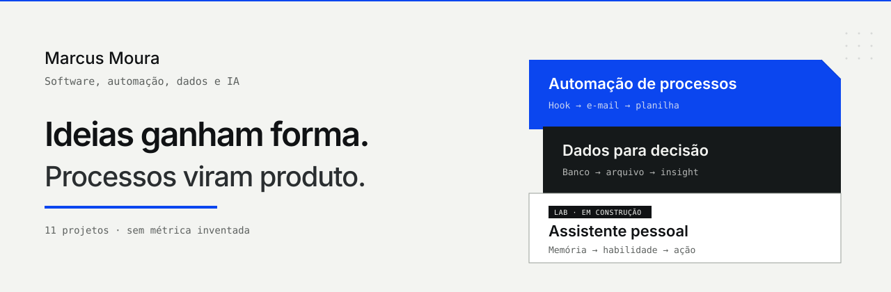
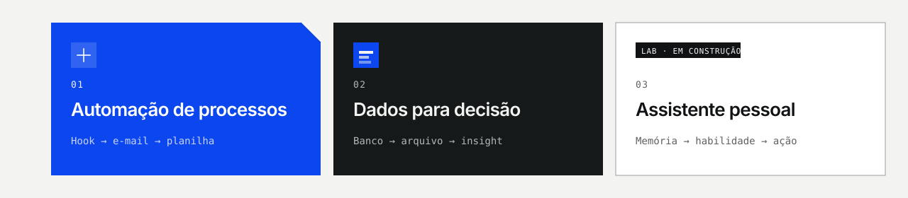

Faço sistema a partir de processo real. São 11 projetos. Sem métrica inventada.

  
  &nbsp;
  

## Curiosidade técnica. Entrega prática.

Sou Marcus Moura. Estudo Engenharia de Software na UNA e faço sistemas, automações e experiências digitais.

Passei por rotina administrativa, atendimento e documentação. Isso me fez olhar o processo antes de escrever código. Vejo o problema, organizo as regras e monto algo que dá para usar.

Uso principalmente Python, APIs REST e SQL. No front, React e JavaScript. Em dados, SQLite, SQLAlchemy e Pandas. Automação com n8n e Ollama. No celular, SwiftUI. Versiono com Git.

**Localização** — Belo Horizonte · Brasil  
**Formação** — Engenharia de Software · UNA  
**Foco** — Python · APIs REST · SQL · automação  
**Explorando** — IA local · agentes · produtos úteis  
**Idiomas** — Português nativo · inglês intermediário  
**Disponível** — Oportunidades · projetos · colaborações

## Frentes

**01 · Automação de processos**  
Quando o processo termina, o sistema manda e-mail e atualiza a planilha.

**02 · Dados para decisão**  
Tira dado de banco, gera arquivo analítico e junta a informação para quem decide.

**03 · Assistente pessoal de IA** · Lab em construção  
IA pessoal com memória controlada, habilidade reutilizável e automação.

## Arquivo

Onze projetos verificados. O detalhe de cada um está no [portfólio](https://marcus-moura-portfolio.mpfagundesmoura.chatgpt.site).

- **Acionamento de Clientes** — automação. Quando o processo termina, o sistema manda e-mail e atualiza a planilha.
- **Automação de Acompanhamento de Faturamento** — dados. Tira dado de banco, gera arquivo analítico e junta a informação para quem decide.
- **Chatbots de Atendimento** — automação. Chatbots em Python, com API, histórico e agendamento automático.
- **Saldo** — web. PWA de finança pessoal, privada e offline: lançamento, meta, recorrência e backup.
- **Inter Task Monitor** — web. Tarefas com Kanban, indicador, filtro, API HTTP e SQLite.
- **[Clima OpenWeather](https://github.com/MarcusMouraDev/Meu-Portif-lio-/blob/main/sistema_clima_openweather.py)** — Python. Consulta o clima em tempo real, guarda histórico e trata erro.
- **[Sistema de Usuários](https://github.com/MarcusMouraDev/Meu-Portif-lio-)** — Python. CRUD de usuário com banco relacional, cada parte no seu lugar, em POO.
- **[RPG de Faculdade](https://github.com/MarcusMouraDev/Meu-Portif-lio-/tree/main/rpg-faculdade)** — Python. RPG de terminal: personagem, classe, missão, batalha e experiência.
- **[Barber Academy](https://github.com/MarcusMouraDev/Meu-Portif-lio-)** — web. Agendamento de barbearia que cai no WhatsApp, pensado para o celular.
- **[Jogo da Forca](https://github.com/MarcusMouraDev/Meu-Portif-lio-/blob/main/jogo-da-forca-poo/jogo_da_forca.py)** — Python. Forca clássica, com classe, controle de tentativa e validação de entrada.
- **Saldo iOS** — mobile. Experimento no iPhone: ver o dinheiro rápido, com privacidade, em interface nativa.

## Quer conversar?

Se o assunto for software, automação, dados ou IA, me chama.

  

[E-mail](mailto:mpfagundesmoura@gmail.com)
· [WhatsApp](https://wa.me/5531993555554)
· [LinkedIn](https://www.linkedin.com/in/marcuspaulomoura)
· [GitHub](https://github.com/MarcusMouraDev)

