  

<h1 align="center">Olá, eu sou Marcus Paulo 👋</h1>

  <strong>Construindo sistemas que transformam processos reais em experiências úteis.</strong> 
  Engenharia de Software · Python · Automação · IA aplicada

  
  
  
  

## `01` // SYSTEM PROFILE

<pre>
LOCATION    Belo Horizonte · Brasil
EDUCATION   Engenharia de Software · UNA
FOCUS       Python · APIs REST · SQL · automação
EXPLORING   IA local · agentes · produtos úteis
LANGUAGES   Português nativo · inglês intermediário
STATUS      ONLINE // BUILDING
</pre>

Minha experiência com rotinas administrativas, atendimento e documentação me ensinou a compreender o processo antes de codificar: observo o problema real, organizo as regras e só então construo uma solução prática, clara e útil para quem vai utilizá-la.

## `02` // FEATURED DEPLOYMENTS

### Portfólio — Marcus Moura

Minha vitrine de projetos em Python, web, APIs, automação e experiências mobile.

**[ACESSAR PORTFÓLIO →](https://marcus-moura-portfolio.mpfagundesmoura.chatgpt.site)**

### Saldo — RPG Financeiro

Uma experiência financeira gamificada para organizar contas, movimentos, metas, orçamento e patrimônio. Os dados permanecem no navegador.

**[INICIAR CAMPANHA →](https://saldo-financas-local.mpfagundesmoura.chatgpt.site)**

## `03` // PROJECT ARCHIVE

- **Sistema climático com OpenWeather** — consulta dados via API, trata respostas e erros e mantém o histórico em SQLite com SQLAlchemy. **[VER CÓDIGO →](https://github.com/MarcusMouraDev/Meu-Portif-lio-/blob/main/sistema_clima_openweather.py)**
- **Jogo da Forca orientado a objetos** — organiza palavra, boneco e partida em classes independentes, com níveis de dificuldade e validação de entradas. **[VER CÓDIGO →](https://github.com/MarcusMouraDev/Meu-Portif-lio-/blob/main/jogo-da-forca-poo/jogo_da_forca.py)**

## `04` // TECHNOLOGY ARSENAL

**Backend**

**Dados**

**Automação/IA**

**Web/Ferramentas**

## `05` // JARVIS · BUILDING

JARVIS é um assistente pessoal em construção que combina IA local com Ollama, memória controlada, habilidades reutilizáveis e fallback em nuvem. A arquitetura busca automatizar tarefas cotidianas sem abrir mão de privacidade, transparência e controle sobre cada execução.

- `[01]` Organizar os módulos e contratos internos
- `[02]` Documentar as decisões de arquitetura
- `[03]` Publicar uma demonstração mínima e reproduzível

## `06` // CURRENT TRANSMISSION

- Engenharia Python, orientação a objetos e boas práticas de desenvolvimento
- Integrações entre APIs, automações e dados persistentes
- Agentes locais controlados, com ferramentas explícitas e execução observável

## `07` // ESTABLISH CONNECTION

Se você trabalha com Python, automação, IA aplicada ou produtos que resolvem problemas reais, vamos trocar ideias.

  
  
  

  <strong>Não construo apenas código — transformo processos em sistemas que fazem sentido.</strong>

